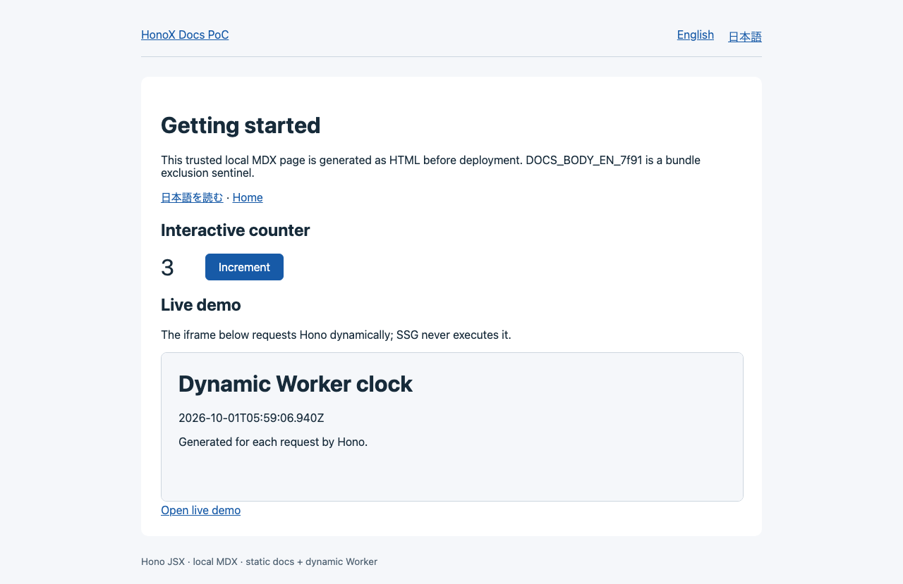

# honoxpress

Documentation metadata, build helpers, and editable UI templates for Hono JSX and MDX.

Use HonoX's file-based routes to build navigation, tables of contents, and language links. Your application owns its routes, renderer, islands, and CSS, so you can adapt the documentation to your existing app.

[npm](https://www.npmjs.com/package/honoxpress) · [Integration guide](docs/api.md) · [Package API](packages/docs/README.md) · [Releases](https://github.com/ts-76/honoxpress/releases) · [MIT License](LICENSE)



## Features

- **Page metadata** — Generate navigation from MDX frontmatter, including titles, descriptions, and display order.
- **Multilingual documentation** — Derive URLs and locales from file paths and connect translations with matching relative slugs. Unavailable translations have no link.
- **Tables of contents and anchors** — Generate a TOC from Markdown headings, with support for Unicode text and duplicate headings.
- **Static docs and dynamic demos** — Build documentation as static pages while keeping demos as dynamic Worker routes.
- **Editable UI** — Copy and customize navigation, TOC, language links, code copying, demo frames, and CSS. Add HonoX islands to MDX where interaction is needed.

honoxpress fits existing HonoX applications and projects that keep their layouts in their own code. It does not include search, a CMS, hosting, or a project generator.

## Install and try the API

```sh
pnpm add honoxpress hono
```

The package is ESM. Node.js engines are `^22.20.0 || ^24.12.0 || >=26.0.0`; the Hono peer dependency is `^4.13.12`. HonoX and MDX build dependencies belong to your application.

`createDocsCatalog` turns page metadata into URLs, navigation, and translation links:

```ts
import { createDocsCatalog } from "honoxpress";

const docs = createDocsCatalog({
  locales: ["en", "ja"],
  defaultLocale: "en",
  entries: [
    { route: "docs/getting-started.mdx", title: "Getting started", order: 1 },
    { route: "ja/docs/getting-started.mdx", title: "はじめに", order: 1 },
  ],
});

docs.page("/docs/getting-started")?.title; // "Getting started"
docs.navigation("ja").map((page) => page.href); // ["/ja/docs/getting-started"]
docs.translations("/docs/getting-started");
// [{ locale: "en", href: "/docs/getting-started" },
//  { locale: "ja", href: "/ja/docs/getting-started" }]
```

This example supplies metadata directly. In a HonoX application, the build plugin generates the catalog from MDX, so you do not need to maintain a second page list. See the [integration guide](docs/api.md) for plugin and renderer setup.

## Run the example

[examples/poc](examples/poc) is a HonoX application with English and Japanese MDX, islands, code copying, and a dynamic demo. Using Node.js 24.12.0 and pnpm 11.22.0:

```sh
git clone https://github.com/ts-76/honoxpress.git
cd honoxpress
pnpm install --frozen-lockfile
pnpm build:package
pnpm dev
```

Open [http://127.0.0.1:5173/docs/getting-started](http://127.0.0.1:5173/docs/getting-started) for English or `/ja/docs/getting-started` for Japanese. The example development server uses port 5173.

```sh
pnpm build
pnpm preview
```

The build runs **client → docs SSG → Worker**. Local production preview uses Cloudflare tooling and requires `cf@1.0.0-beta.6`. See the [compatibility guide](docs/compatibility.md) for dependency versions and environment requirements.

## Add MDX pages

Place trusted local MDX under the standard `app/routes` directory. With `defaultLocale: "en"`:

| File                                     | URL                        |
| ---------------------------------------- | -------------------------- |
| `app/routes/docs/index.mdx`              | `/docs`                    |
| `app/routes/docs/getting-started.mdx`    | `/docs/getting-started`    |
| `app/routes/ja/docs/getting-started.mdx` | `/ja/docs/getting-started` |

```mdx
---
title: Getting started
description: Install the package and create your first page.
order: 1
---

# Getting started

## Installation

Write your documentation here.
```

`title` is required; `description` and numeric `order` are optional. The file path establishes page identity; frontmatter `id` is not used. Navigation sorts by `order` (default `0`), then URL.

## Customize the UI

Templates are exported as files through `honoxpress/templates/*`:

| Template         | Destination in your app         |
| ---------------- | ------------------------------- |
| `docs-ui.tsx`    | `app/components/docs-ui.tsx`    |
| `copy-code.tsx`  | `app/islands/copy-code.tsx`     |
| `demo-frame.tsx` | `app/components/demo-frame.tsx` |
| `docs.css`       | Your public stylesheet          |

Copy the files into your app and edit them to fit your design. **Place `copy-code.tsx` under `app/islands`** so HonoX can discover it. Importing the component directly from the package does not register an application island.

The templates include mobile navigation and TOC disclosures, visible keyboard focus, a skip link, copy success/failure feedback, and color-scheme tokens. Review and merge template updates manually, preserving the MIT copyright and permission notice in distributed copies. The [integration guide](docs/api.md#copy-and-customize-the-ui) includes a copy script.

## Build model and scope

`honoxpress` provides runtime metadata APIs. `honoxpress/build` provides build-time MDX discovery, heading transformation, and SSG filtering. Your HonoX application configures its router and renderer.

- MDX can execute JavaScript. Use trusted local files.
- `worker: true` stops metadata discovery from importing MDX. To also exclude MDX bodies from the Worker, use `honox/server/base` with explicit globs selecting dynamic routes. The SSG filter alone does not remove those imports.
- Navigation uses ordinary document loads. Island state resets when you leave a page.
- CI runs on Node.js 22.23.3, 24.12.0, and 24.21.0, validating the package, example, and installation of a packed tarball in an independent application. Node.js 26, other operating systems/browsers, and production Cloudflare deployment are outside that CI coverage.

honoxpress is a 0.x library. Pin your package version and review the [changelog](CHANGELOG.md) and [compatibility guide](docs/compatibility.md) before upgrading.

## Documentation and development

- [Integration guide / API](docs/api.md) — MDX, Vite, renderer, templates, and Worker configuration
- [Compatibility guide](docs/compatibility.md) — Tested environments and known limitations
- [Example application](examples/poc) — The complete client/SSG/Worker pipeline
- [Changelog](CHANGELOG.md) / [Releases](https://github.com/ts-76/honoxpress/releases)
- [Contributing](CONTRIBUTING.md) — Development setup, verification, and PR workflow

Report bugs and proposals in [GitHub Issues](https://github.com/ts-76/honoxpress/issues). Include package/toolchain versions, reproduction steps, the affected URL, and whether the problem occurs in dev, SSG, or Worker mode.

## License and acknowledgements

[MIT](LICENSE) © 2026 ts-76.

Thank you to [Cloudflare Nimbus](https://github.com/cloudflare/nimbus) for its reading width, spacing, and navigation hierarchy, and [Fumapress](https://github.com/fuma-nama/fumapress) for its current-page accent, code actions, and mobile TOC. The templates' JSX, CSS, and icons were independently written.
